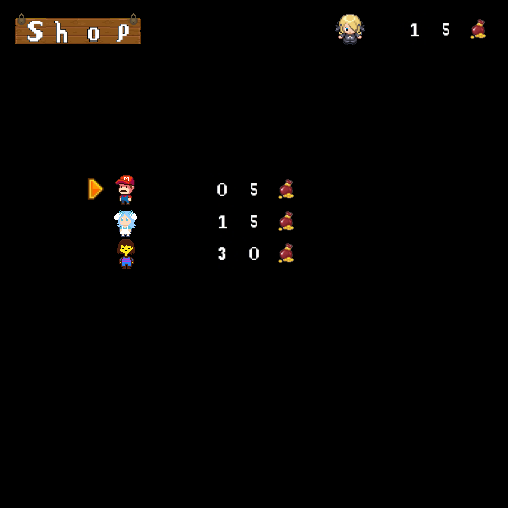

# Sokoban game written in Java🧱


<div style="display: flex; justify-content: space-around; align-items: center;">
  
  
</div>

Java project done in the context of the oriented-object programming course (INFO0062) given by Pr. Boigelot, ULiège.<br>
This project has been done by me (Simon Gardier) and Camille Trinh :)<br>
The final mark for this project is 20/20.

## Summary
1. [Try it!](#try-it)
2. [Features](#features)
3. [Implementation](#implementation)
4. [Credits](#credits)

## Try it
Sokoban is a problem-solving game where you have to move boxes to specific locations to access the next level.<br>
Take a look at the [features](#features) section to know more about the games rules.<br>
To play the game :<br>
- Install Java (version >= 8) jdk (https://www.oracle.com/java/technologies/downloads/)

- Clone the repository
```console
git clone git@github.com:sgardier/sokoban.git locationOfTheGame
```
- Go to the folder of the projet
```console
cd locationOfTheGame
```
- Run the ```javac``` command at the root of the directory
```console
javac -cp ".;sokoban-gui.jar" be/uliege/boigelot/oop/sokoban/main/Sokoban.java
```
- To start the game run the ```javac``` command at the root of the directory
```console
java -cp ".;sokoban-gui.jar" be/uliege/boigelot/oop/sokoban/main/Sokoban
```
Note : replace the ; by : if you are on Linux :)

## Features
- 1 way cells : The player can go on the cell from any side but they are forced to move to the direction indicated by the arrow on the cell.

- Shop : At the end of each level (except for the last one) the player has the possibility to buy different appearances. Each level rewards the player with a fixed amount of gold (specific to each level).
	*Controls :
	- up : move the selection arrow to the upper item.
	- bottom : move the selection arrow to the below item. 
	- right : buy the selected item if the player has enough money or equip it if he has already bought it.
	- left : quit the shop and display the next level.
The downfall of the shop/reward system is that we are limited by the SokobanGUI for the drawing of  numbers. However, with our implementation it is possible to display numbers in the range [0, 99].

- Fixed crate : When placed on a target, a crate can’t be moved anymore. This feature allows original level design. However, it would not be hard to change it since the “movable” property of a crate is only a boolean value verified when we try to move it. 

- Heavy crate : The player can only push one crate at a time.

## Implementation
- The management of the images is done as the following : each image is loaded and linked to a “CellType” in the UI class. CellType is used in the rest of the code to refer to an image.

- Each level is represented by a specific “Level” object. A level contains a grid of Cells. There are several types (classes inheriting from Cell) : Wall, Target, Empty and Arrow. A cell contains a background (a CellType) and a content (an Entity). We can ask the cell its content, its background, add a content, remove a content,...

- The game consists in moving a player and crates. These are implemented by the class Entity (and its subclasses : Player and Crates). An Entity has an image representation (a CellType), is movable or not, can return its attributes,...

- Since we draw two types of content in the Window (the shop and the game board) we have created a WindowContent superclass whose subclasses implement a draw() and an update() function.

- Having to draw various things like letters, numbers and CellType, we have overloaded a draw() method which can receive either a character, a number or a CellType in parameter.

## Credits
- [Simon Gardier](https://github.com/sgardier) (Co-author)
- Camille Trinh (Co-author)
